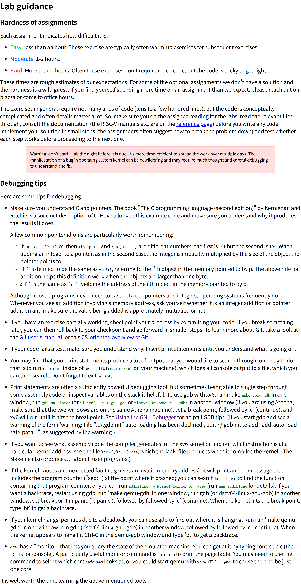

# 简介  

本实验为[MIT xv6-riscv-labs 2024版（6.828/6.s081）](https://pdos.csail.mit.edu/6.828/2024/)  

本实验环境及操作系统源码遵循原许可证（见各实验分支），本人实验报告和实验代码遵循`GPL v3`许可证  

  

本仓库有多个分支，除`report`实验报告分支（本分支）外，每个分支对应一个实验，以下是分支列表：  
  * `report` - 报告分支  
  * `util` - Lab: Xv6 and Unix utilities  
  * `syscall` - Lab: system calls  
  * `pgtbl` - Lab: page tables  
  * `traps` - Lab: traps  
  * `cow` - Lab: Copy-on-Write Fork for xv6  
  * `net` - Lab: networking  
  * `lock` - Lab: locks  
  * `fs` - Lab: file system  
  * `mmap` - Lab: mmap  

# 网页快照  

## Tools  

  

## Guidance  

  

## Lab: Xv6 and Unix utilities  

  

## Lab: system calls  

  

## Lab: page tables  

  

## Lab: traps  

  

## Lab: Copy-on-Write Fork for xv6  

  

## Lab: networking  

  

## Lab: locks  

  

## Lab: file system  

  

## Lab: mmap  

  