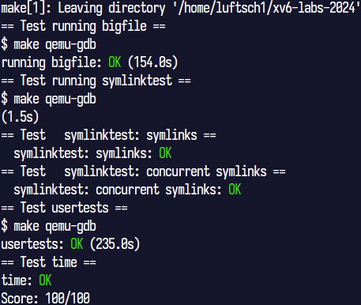

# xv6-riscv实验报告

> 2253713 戴金瓯

实验版本：[2024](https://pdos.csail.mit.edu/6.828/2024/)  
实验仓库：[https://github.com/LUFTSCH1/xv6-labs-2024](https://github.com/LUFTSCH1/xv6-labs-2024)  

## 配置实验环境

物理机环境：`Windows 11 (x64)`  
[官方文档-安装说明部分](https://pdos.csail.mit.edu/6.828/2024/tools.html) 给出了许多环境的配置方式，这里选择使用`WSL2`进行实验环境配置，代码编辑器选用`Visual Studio Code`。  

### 安装`WSL发行版`

打开`Microsoft Store`应用，搜索`Debian`并安装即可，本次实验所使用的版本为`Debian 12.9`，安装完成可以直接点击“打开”、在“开始”菜单旁的“搜索”功能输入`Debian`或是直接在`CMD`/`Power Shell`中输入`bash`启动（若安装了多个`WSL发行版`，则应注意该方式启动的是默认发行版）。  

### 配置`WSL发行版`

#### 官方要求的项目环境配置

按照官网说明，需要安装一些工具，命令如下：
```bash
sudo apt-get update && sudo apt-get upgrade
sudo apt-get install git build-essential gdb-multiarch qemu-system-misc gcc-riscv64-linux-gnu binutils-riscv64-linux-gnu
```
简单解释一下安装内容：
  * `git`：版本控制工具
  * `build-essential`：开发工具组合，主要使用其中的`make`（自动化构建工具）
  * `gdb-multiarch`：GNU调试器
  * `qemu-system-misc`：QEMU全系统模拟器
  * `gcc-riscv64-linux-gnu`：`RISC-V 64`交叉编译器
  * `binutils-riscv64-linux-gnu`：`RISC-V 64`二进制工具

**使用如下命令检验安装是否成功**：  

所有发行版下均一致的命令（成功则显示版本号）：
```bash
qemu-system-riscv64 --version
```
接着以下三条有一条执行成功即可：
```bash
riscv64-linux-gnu-gcc --version
riscv64-unknown-elf-gcc --version
riscv64-unknown-linux-gnu-gcc --version
```

### 编辑器（`Visual Studio Code`）配置

`Visual Studio Code`安装在物理机中。在插件栏搜索并安装`WSL`插件，完成后左边栏将多出一个图标，为`远程资源管理器`。点击`远程资源管理器`，选择`WSL目标`中`Debian发行版`对应的选项进行连接。连接完成后若没有显示终端，则在左上角`查看`菜单中打开`终端`，现在可以在编辑器的终端中操作Linux子系统了。  

### 拉取实验仓库

按照官方给出的仓库地址，执行：
```bash
git clone git://g.csail.mit.edu/xv6-labs-2024
```
**不要**拉取`GitHub`上的`mit-pdos/xv6-riscv`仓库，最简单直接的理由就是它没有提供实验测试脚本。  
现在，实验目录就在`~/xv6-labs-2024`，在编辑器左边的`资源管理器`中使用`打开文件夹`功能，打开这个目录。  

### 继续配置项目

如果要使用`git`进行版本控制，建议在`.gitignore`文件中加上如下配置：
```.gitignore
.vscode/
.cache/
__pycache__/
compile_commands.json
*.pdf
```
推送到`GitHub`远程仓库时，如需特殊网络环境，直接使用物理机代理软件的`虚拟网卡`（`TUN`）模式即可。  

### 第一次构建

#### 实验指导使用的命令

```bash
make qemu
```
依照实验指导，在项目根目录下输入以上命令来构建。完成构建则会自动启动`xv6`内核，按`Ctrl+A`后按`X`可以退出`QEMU`，回到Linux系统中。  

## 实验系统调用（`user/user.h`）

| 系统调用 | 解释 |
| :-- | :-- |
| `int fork(void)` | 创建一个子进程（当前进程的完整副本）；返回其PID（若本身为`fork()`产生的子进程，返回0；错误时返回-1） |
| `int exit(int status) __attribute__((noreturn))` | 终止当前进程；`status`报告给`wait()`；返回指令不会被执行，故实际无返回值 |
| `int wait(int *status)` | 等待子进程退出；退出状态存在`*status`（`status`为`(int *)0`表示不关心子进程退出状态）；返回值为子进程PID |
| `int kill(int pid)` | 根据传入的PID终止对应进程；返回值为0或-1（错误） |
| `int getpid(void)` | 返回值为当前进程的PID |
| `int sleep(int n)` | 暂停n个时钟节拍；总是返回0 |
| `int exec(const char *file, char **argv)` | 加载`file`路径对应文件并用给定的`argv`参数表执行；成功时当前进程空间被覆盖，无返回，失败返回-1 |
| `char *sbrk(int n)` | `n`为0时仅查询堆顶，返回当前堆结束地址；`n`为正时扩展堆空间，返回原堆顶地址；`n`为负时收缩堆空间，返回原堆顶地址；执行失败返回`(char *)-1` |
| `int open(const char *file, int flags)` | 打开`file`路径对应文件，`flags`为打开模式，有`O_RDONLY`、`O_WRONLY`、`O_RDWR`、`O_CREATE`和`O_TRUNC`及其组合（按位或进行组合）；成功返回文件描述符（正数），失败返回-1 |
| `int write(int fd, const void *buf, int n)` | 向文件描述符`fd`写入`buf`开始的`n`字节数据；返回n |
| `int read(int fd, void *buf, int n)` | 从文件描述符`fd`读取`n`字节数据存入`buf`；返回读取字节数，如已到文件末尾返回0 |
| `int close(int fd)` | 释放打开的文件`fd`；成功返回0，失败返回-1 |
| `int dup(int fd)` | 找到进程`fd表`里最小的一个没用的槽位，复制`fd`指向的打开文件对象到这个新槽；返回新`fd` |
| `int pipe(int *p)` | 创建一个管道，将读、写文件描述符分别放入`p[0]`、`p[1]`；创建成功返回0，失败返回-1 |
| `int chdir(const char *dir)` | 修改当前进程的工作目录；成功返回0，失败返回-1 |
| `int mkdir(const char *dir)` | 新建目录；成功返回0，失败返回-1 |
| `int mknod(const char *file, short major, short minor)` | 创建设备文件，`file`为设备文件路径，`major`为主设备号（标识设备类型），`minor`为次设备号（标识具体设备实例）；成功返回0，失败返回-1 |
| `int fstat(int fd, struct stat *st)` | 查询`fd`对应文件元数据存入`*st`；成功返回0，失败返回-1 |
| `int link(const char *file1, const char *file2)` | 为`file1`创建别名（硬链接）`file2`；成功返回0，失败返回-1 |
| `int unlink(const char *file)` | 删除文件链接；成功返回0，失败返回-1 |

## Lab: Xv6 and Unix utilities（git checkout util）

### sleep（`user/sleep.c` 难度：easy）

#### 题目

为`xv6`提供一个用户级工具`sleep`，类似`UNIX`中的`sleep`命令。你的`sleep`工具应该暂停用户指定的时钟节拍数（节拍是`xv6`内核定义的时间概念，即定时器芯片两次中断之间的时间间隔）你的解决方案应位于文件`user/sleep.c`中。  

#### 简要分析

思路上只需要从参数中拿到用户指定的时钟节拍数，直接传给`sleep`系统调用即可。实现上有几个注意点：  
  * `xv6`中没有`标准C runtime初始化系统`（包含于`libc`中），其进程的退出必须调用`int exit(int status)`，而不是在主函数中直接`return`（实际上平时写的`return 0;`后还有`libc`调用`exit`）。  
  * 提示中说明从数字字符串转换为整型变量可以用`int atoi(const char *s)`（定义位于`user/ulib.c`），从其实现可以看出：转换失败返回0，成功返回一个正数。  

#### 代码

```c
#include "kernel/types.h"
#include "kernel/stat.h"
#include "user/user.h"

int
main(int argc, char *argv[])
{
  int interval;
  if (argc != 2 || (interval = atoi(argv[1])) <= 0) {
    fprintf(2, "Usage: %s <positive_integer_interval>\n", argv[0]);
    exit(1);
  }

  sleep(interval);

  exit(0);
}
```

#### 本题额外说明

接着在项目根目录`Makefile`文件第180行的`UPROGS`项下追加：
```makefile
...
UPROGS=\
  ...
  $U/_sleep\ # 即 $U/_{不带.c后缀的文件名}\
...
```
保存后使用前面提到的`make qemu`命令构建即可。`util`中每个实验都要做这步操作。  

除了在`xv6`内核的命令行界面手动输入`sleep 10`之类的命令进行测试之外，还可以使用测试脚本，用法是在项目根目录下输入命令：
```bash
./grade-lab-util sleep
```
如无执行权限，则`chmod`追加执行权限后再尝试：
```bash
chmod +x ./grade-lab-util
```  

### pingpong（`user/pingpong.c` 难度：easy）

#### 题目

编写一个用户级程序，使用`xv6`系统调用通过一对管道在两个进程之间“ping pong”发送一个字节。父进程应向子进程发送一个字节；子进程应打印“`<pid>: received ping`”（其中`<pid>`是子进程PID），并将该字节通过管道写入父进程，然后退出；父进程应从子进程读取该字节，打印“`<pid>: received pong`”（其中`<pid>`是父进程PID），然后退出。你的解决方案应位于文件`user/pingpong.c`中。  

#### 简要分析

先来了解`xv6`的`fork`、`pipe`、`wait`机制：
  * `fork`：从含`fork()`的语句处对进程进行“分身”，将当前进程作为父进程，完整拷贝一份父进程的内存数据生成子进程，这两个进程会被挂起等待调度。父进程将从刚刚提到的含`fork()`的那句继续执行，其`fork()`函数返回子进程的PID（一个正数）；子进程也将从同一句（仅代码角度的同一句）开始执行，其`fork()`调用返回0，表示它是子进程。
  * `文件描述符`：`文件描述符`指向一个`打开的文件对象`，但其并非一对一的关系，而是一对多的关系。就像房卡与房间，可能有多名客人入住酒店的一间多床房间，每名客人都有一张可以开启房门的房卡，只有当所有客人都归还房卡（客人视角的“退房”操作）时，才可以让工作人员前往“释放”这个房间。对于文件描述符和打开的文件对象而言，这就是在底层增加了一个`引用计数`，其数值就是使用这个文件的进程数。`fork()`复制进程时会增加这个引用计数。可以手动`close(文件描述符)`来减少引用计数，也可以让操作系统自动在进程退出后减少对应的引用计数。打开的文件对象将在引用计数归零时释放。
  * `pipe`：管道是一种虚拟文件，打开管道`int pipe(int p[])`将生成一对读、写文件描述符分别存入`&p[0]`、`&p[1]`处。在打开的读、写文件对象的引用计数均归零后管道会被释放。
  * `wait`：子进程执行完后不会完全消失，而是进入`僵尸进程`状态，需要父进程调用`int wait(int *status)`进行回收，这是`wait`的根本作用。另外，由于父子进程执行顺序完全取决于操作系统的调度，尽管调度算法是确定的，但实际情况相当复杂，故可以认为执行顺序不确定。调整父进程中`wait`调用的位置可以保证其之后的语句一定在子进程退出后执行，在必要时可以通过`status`确定子进程执行是否成功。

#### 代码

```c
#include "kernel/types.h"
#include "kernel/stat.h"
#include "user/user.h"

#define  PREAD (0)
#define PWRITE (1)

static void errquit(int, const char *) __attribute__((noreturn));

static void
errquit(const int status, const char *const prompt)
{
  write(2, prompt, strlen(prompt));
  write(2, "\n", 1);
  exit(status);
}

int
main(int argc, char *argv[])
{
  // 虽然一个管道也能完成，但题目要求一对管道，每个负责一个方向
  int pwcr[2], prcw[2]; // pwcr父写子读，prcw父读子写
  if (pipe(pwcr) || pipe(prcw)) {
    errquit(1,"failed to create pipe");
  }

  const int pid = fork(); // 尝试创建子进程
  if (pid < 0) {
    errquit(1, "failed to fork");
  }

  uint8 data = 0; // 一字节数据

  if (pid == 0) {
    close(pwcr[PWRITE]), close(prcw[PREAD]); // 关闭子进程不需要的端
    read(pwcr[PREAD], &data, sizeof(data)), close(pwcr[PREAD]); // 子进程读后关闭pwcr读端
    printf("%d: received ping\n", getpid());
    write(prcw[PWRITE], &data, sizeof(data)), close(prcw[PWRITE]); // 子进程写后关闭prcw写端
  } else {
    close(pwcr[PREAD]), close(prcw[PWRITE]); // 关闭父进程不需要的端
    write(pwcr[PWRITE], "d", sizeof(data)), close(pwcr[PWRITE]); // 父进程写后关闭pwcr写端
    wait((int *)0); // 等待子进程退出，fork()成功后退出status一定为0，不用关心状态
    read(prcw[PREAD], &data, sizeof(data)), close(prcw[PREAD]); // 父进程读后关闭prcw读端
    printf("%d: received pong\n", getpid());
  }
  exit(0);
}
```

### primes（`user/primes.c` 难度：hard）

#### 题目

用管道为`xv6`编写一个并行素数筛程序。使用`pipe`和`fork`来设置管道，第一个进程将2到280间的数送入管道。对于每个素数，你需要创建一个进程，该进程通过一个管道从其左侧相邻进程读取数据，并通过另一个管道写入其右侧相邻的进程。由于`xv6`的文件描述符和进程数量有限，因此第一个进程可以在280处停止。你的解决方案应位于文件`user/primes.c`中。  

#### 简要分析

本题可以采用埃氏筛进行实现。每个管道视为一个序列，顺序为数写入的先后（从小到大写入）。主进程显然有一个2-280的序列，然后进行筛除。每次取出并打印序列首的数，这一定是当前序列中最小的质数，然后将序列中不能被该数整除的数按顺序复制进新的序列（新管道）；重复上述过程，直到序列为空。  

#### 代码

```c
#include "kernel/types.h"
#include "kernel/stat.h"
#include "user/user.h"

#define  PREAD (0)
#define PWRITE (1)
#define INT_SIZE sizeof(int)
#define UPPER_REALM (280)

static void errquit(int, const char *) __attribute__((noreturn));
static void prime(int) __attribute__((noreturn));

static const char S_EXCE_PIPE[] = "failed to create pipe";
static const char S_EXCE_FORK[] = "failed to fork";

static void
errquit(const int status, const char *const prompt)
{
  write(2, prompt, strlen(prompt));
  write(2, "\n", 1);
  exit(status);
}

static void
prime(const int rfd)
{
  int pri;
  if (read(rfd, &pri, INT_SIZE) != INT_SIZE) {
    close(rfd);
    exit(0);
  }
  printf("prime %d\n", pri);

  int nxtpipe[2];
  if (pipe(nxtpipe)) {
    errquit(1, S_EXCE_PIPE);
  }
  const int pid = fork();
  if (pid < 0) {
    errquit(1, S_EXCE_FORK);
  }

  if (pid == 0) {
    close(rfd), close(nxtpipe[PWRITE]);
    prime(nxtpipe[PREAD]);
  }
  close(nxtpipe[PREAD]);
  for (int n; read(rfd, &n, INT_SIZE) == INT_SIZE; ) {
    if (n % pri) {
      write(nxtpipe[PWRITE], &n, INT_SIZE);
    }
  }
  close(rfd), close(nxtpipe[PWRITE]);
  int cstatus;
  wait(&cstatus);
  exit(cstatus);
}

int
main(int argc, char *argv[])
{
  int fds[2];
  if (pipe(fds)) {
    errquit(1, S_EXCE_PIPE);
  }

  const int pid = fork();
  if (pid < 0) {
    errquit(1, S_EXCE_FORK);
  }

  if (pid == 0) {
    close(fds[PWRITE]);
    prime(fds[PREAD]);
  }
  close(fds[PREAD]);
  for (int i = 2; i <= UPPER_REALM; ++i) {
    write(fds[PWRITE], &i, INT_SIZE);
  }
  close(fds[PWRITE]);
  int cstatus;
  wait(&cstatus);
  exit(cstatus);
}
```

### find（`user/find.c` 难度：中等）

#### 题目

为`xv6`写一个简化的`UNIX` `find`程序：查找目录树中所有指定名称的文件，你的解决方案应位于文件`user/find.c`中。  

#### 简要分析

需要阅读`user/ls.h`来了解如何读取目录。阅读源码并查看函数定义后发现，`xv6`中，有三种文件类型，分别由宏`T_DEVICE`、`T_FILE`和`T_DIR`标识。`目录`也是一种特殊的文件，`目录文件`存储着目录中的`目录项`。目录项由结构体`dirent`定义，其成员是`short inum`和`char name[DIRSIZ]`。前者标识目录项是否被使用（0表示空目录项）；后者是目录项对应目录中的的文件名。读取目录时，以只读模式打开目录文件并获取其文件描述符，使用`read`将该文件逐项读入一个`dirent`中，就可以获取目录内的目录项的名字。如果需要这个目录项对应的详细信息（如它到底是设备、文件、还是目录等），则需要将这个名字拼接到关于当前进程工作目录的相对路径中，使用`stat`（相较于`fstat`，`stat`在获取文件元数据时不需要手动打开文件，适合后续不需要文件描述符的操作，便于管理）将文件元数据读取到`stat`结构体中。`find`递归实现中，由于保证先遍历完当前目录中的文件再进入下级目录需要额外开销，故直接先按默认顺序遍历（遇到文件比较是不是目标，遇到目录直接先进去），这种方式直接通过了测试。  

#### 代码

```c
#include "kernel/types.h"
#include "kernel/stat.h"
#include "kernel/fcntl.h"
#include "kernel/fs.h"
#include "user/user.h"

static void errquit(int, const char *) __attribute__((noreturn));

static char buf[512];
static const char *dst;

static void
errquit(const int status, const char *const prompt)
{
  write(2, prompt, strlen(prompt));
  write(2, "\n", 1);
  exit(status);
}

static void
checkroot(const char *const root)
{
  const int fd = open(root, O_RDONLY);
  if (fd < 0) {
    errquit(1, "failed to open root_directory");
  }
  struct stat st;
  if (fstat(fd, &st) < 0) {
    errquit(1, "failed to stat root_directory");
  }
  if (st.type != T_DIR) {
    errquit(1, "root_directory must be a directory");
  }
  close(fd);
}

static void
find(char *cur_end, int depth)
{
  if (cur_end - buf + 1 + DIRSIZ + 1 > sizeof(buf)) {
    fprintf(2, "path too long\n");
    return;
  }
  const int fd = open(buf, O_RDONLY);
  if (fd < 0) {
    fprintf(2, "cannot open\n");
    return;
  }
  
  int not_found = 1;
  *cur_end++ = '/';
  for (struct dirent de; read(fd, &de, sizeof(de)) == sizeof(de); ) {
    // 排除空目录项、当前目录、父目录
    if (de.inum == 0 || !strcmp(de.name, ".") || !strcmp(de.name, "..")) {
      continue;
    }
    strcpy(cur_end, de.name);
    struct stat st;
    if (stat(buf, &st) < 0) {
      fprintf(2, "cannot stat\n");
      continue;
    }
    if (not_found && st.type == T_FILE) {
      if (!(not_found = strcmp(de.name, dst))) {
        printf("%s\n", buf);
      }
    } else if (st.type == T_DIR) {
      find(cur_end + strlen(de.name), depth + 1);
    }
  }
  close(fd);
}

int
main(int argc, char *argv[])
{
  if (argc != 2 && argc != 3) {
    fprintf(
      2,
      "Usage: %s [root_directory] <file_name>\n"
      "  Default root_directory is \".\"\n",
      argv[0]
    );
    exit(1);
  }

  if (argc == 2) {
    strcpy(buf, ".");
    dst = argv[1];
  } else {
    strcpy(buf, argv[1]);
    dst = argv[2];
  }
  checkroot(buf);
  find(buf + strlen(buf), 0);
  exit(0);
}
```

### xargs（`user/xargs.c` 难度：中等）

#### 题目

为`xv6`编写一个`UNIX xargs`程序的简单版本：它的参数描述一个要运行的命令，它从标准输入读取一行，然后逐行运行该命令，并将该行附加到命令的参数中。你的解决方案应位于文件`user/xargs.c`中。  

#### 简要分析

创建一个缓冲数组，将标准输入中的参数逐个读入该数组中，并将其首地址追加入`argv`数组，每个参数以尾零分隔，读完一行则`fork`一个子进程去执行（因为`exec`调用成功会覆盖当前进程，故必须让进程副本去执行）。  

#### 代码

```c
#include "kernel/types.h"
#include "kernel/stat.h"
#include "kernel/param.h"
#include "user/user.h"

#define MAXLEN (1024)

enum argst {
  ARGST_CUT,
  ARGST_NORMAL,
  ARGST_LAST
};

static void errquit(int, const char *) __attribute__((noreturn));

static void
errquit(const int status, const char *const prompt)
{
  write(2, prompt, strlen(prompt));
  write(2, "\n", 1);
  exit(status);
}

static int
getchar(void)
{
  char ch;
  if (read(0, &ch, sizeof(ch)) != sizeof(ch)) {
    return 0;
  }
  return ch;
}

static int
readarg(char *const buf, int maxsize, enum argst *const st)
{
  --maxsize;
  *st = ARGST_NORMAL;
  int ch;
  do {
    ch = getchar();
  } while (ch == ' ' || ch == '\t');
  if (ch == 0) {
    return 0;
  }
  char *p = buf;
  do {
    if (ch == '\n') {
      *st = ARGST_LAST;
      break;
    }
    if (p - buf >= maxsize) {
      *st = ARGST_CUT;
      return 0;
    }
    *p++ = (char)ch;
    ch = getchar();
  } while (ch != 0 && ch != ' ' && ch != '\t');
  *p = '\0';
  return p - buf;
}

int
main(int argc, char *argv[])
{
  if (argc < 2) {
    fprintf(2, "Usage: xargs <command> [initial-args...]\n");
    exit(1);
  }

  char *exec_argv[MAXARG];
  for (int i = 1; i < argc; ++i) {
    exec_argv[i - 1] = argv[i];
  }
  const int base = argc - 1;

  while (1) {
    char buf[MAXLEN];
    {
      char *p = buf;
      enum argst st;
      int len, rest = MAXLEN, pos = base;
      while ((len = readarg(p, rest, &st)) &&
             st != ARGST_CUT &&
             pos < MAXARG - 1) {
        exec_argv[pos++] = p;
        p += len + 1;
        rest -= len + 1;
        if (st == ARGST_LAST) {
          break;
        }
      }
      if (p == buf) {
        break;
      }
      if (st == ARGST_CUT) {
        errquit(1, "line too long, exec ended");
      }
      exec_argv[pos] = (char *)0;
    }

    const int pid = fork();
    if (pid < 0) {
      errquit(1, "failed to fork");
    }
    if (pid == 0) {
      exec(exec_argv[0], exec_argv);
      errquit(1, "failed to exec");
    }
    int cstatus;
    wait(&cstatus);
    if (cstatus) {
      errquit(cstatus, "exec line failed");
    }
  }
  exit(0);
}
```
### 测试

在根目录上创建一个`time.txt`，内容为一个整型，记录实验用时（小时数）。然后测试目录结构和所有题目：

```bash
make grade
```


## Lab: System calls（git checkout syscall）

### gdb

```c
struct proc {
  lock = {
    locked = 0x0,
    name = 0x800071c8,
    cpu = 0x0
  },
  state = 0x4,
  chan = 0x0,
  killed = 0x0,
  xstate = 0x0,
  pid = 0x1,
  parent = 0x0,
  kstack = 0x3fffffd000,
  sz = 0x1000,
  pagetable = 0x87f55000,
  trapframe = 0x87f56000,
  context = {
    ra = 0x8000124e,
    sp = 0x3fffffde80,
    s0 = 0x3fffffdeb0,
    s1 = 0x80007d80,
    s2 = 0x80007950,
    s3 = 0x1,
    s4 = 0x8000dc08,
    s5 = 0x3,
    s6 = 0x80018a20,
    s7 = 0x1,
    s8 = 0x80018b48,
    s9 = 0x4,
    s10 = 0x0,
    s11 = 0x0
  },
  ofile = {
    0x0, 0x0, 0x0, 0x0,
    0x0, 0x0, 0x0, 0x0,
    0x0, 0x0, 0x0, 0x0,
    0x0, 0x0, 0x0, 0x0
  },
  cwd = 0x80015e90,
  name = {
    0x69, 0x6e, 0x69, 0x74,
    0x63, 0x6f, 0x64, 0x65,
    0x0, 0x0, 0x0, 0x0,
    0x0, 0x0, 0x0, 0x0
  }
}
```

#### Looking at the backtrace output, which function called syscall?

  - usertrap

#### What is the value of p->trapframe->a7 and what does that value represent? (Hint: look user/initcode.S, the first user program xv6 starts.)

  - `0x2`，为一个系统调用号，代表`SYS_exit`

#### What was the previous mode that the CPU was in?

  - $sstatus = `0x200000022`，SPP (Bit 8) = 0，User Mode

#### Write down the assembly instruction the kernel is panicing at. Which register corresponds to the variable num?

```assembly
// num = p->trapframe->a7;
num = *(int *)0;
  80001c1e:	00002683          	lw	a3,0(zero) # 0 <_entry-0x80000000>
```
  - 寄存器: a3

#### Why does the kernel crash? Hint: look at figure 3-3 in the text; is address 0 mapped in the kernel address space? Is that confirmed by the value in scause above? (See description of scause in RISC-V privileged instructions)

  - 内核地址空间从`0x80000000`开始，`0x0`为用户地址空间起始，不在内核地址空间范围内。
  - RISC-V的CPU检测到内存非法访问后会触发load page fault异常，并自动设置scause寄存器记录原因。内核恐慌时scause寄存器内的值为`0xd`，含义为加载地址错误，证实了结论。

#### What is the name of the process that was running when the kernel paniced? What is its process id (pid)?

  - 进程名：initcode，pid：1

### System call tracing（`user/trace.c` 难度：中等）

#### 题目

在本作业中，你将添加一个系统调用跟踪功能，该功能可能有助于你调试后续的实验。你将创建一个新的`trace`系统调用来控制跟踪。它应该接受一个参数，即一个整数“掩码”，其位指定要跟踪的系统调用。例如，要跟踪`fork`系统调用，程序会调用`trace(1 << SYS_fork)`，其中`SYS_fork`是`kernel/syscall.h`中的系统调用编号。如果系统调用的编号在掩码中设置，则你必须修改`xv6`内核，使其在每个系统调用即将返回时打印一行。该行应包含进程ID、系统调用名称和返回值；你无需打印系统调用参数。`trace`系统调用应该启用对调用它的进程及其后续分叉的任何子进程的跟踪，但不应影响其他进程。  

#### 步骤

- `Makefile`中添加`trace`：
```makefile
...
UPROGS=\
	...
	$U/_trace\
...
```

- `user/user.h`中添加函数声明：
```c
...
// system calls
int fork(void);
...
int trace(int);
```

- `user/usys.pl`中添加系统调用存根：
```perl
...
entry("trace");
```

- `kernel/syscall.h`中添加系统调用号：
```c
...
#define SYS_trace 22
```

- `kernel/proc.h`中添加`proc`结构体成员储存掩码：
```c
...
struct proc {
  ...
  int tmask; // Trace mask
  ...
};
```

- `kernel/sysproc.c`末尾定义`sys_trace`函数：
```c
...
uint64
sys_trace(void)
{
  int mask;
  argint(0, &mask);
  myproc()->tmask = mask;
  return 0;
}
```

- `kernel/proc.c`中修改`fork`函数定义：
```c
...
int
fork(void)
{
  ...
  np->cwd = idup(p->cwd);
  np->tmask = p->tmask; // 添加该行

  safestrcpy(np->name, p->name, sizeof(p->name));
  ...
}
...
```

- `kernel/syscall.c`中修改如下标注的四处：
```c
...
// Prototypes for the functions that handle system calls.
extern uint64 sys_fork(void);
...
extern uint64 sys_trace(void); // 1 添加外部声明 +1行
...
static uint64 (*syscalls[])(void) = {
...
[SYS_trace] sys_trace          // 2 添加入系统调用函数指针数组 +1行
};

static char *syscall_name[] = {
[SYS_fork]    "fork",
[SYS_exit]    "exit",
[SYS_wait]    "wait",
[SYS_pipe]    "pipe",
[SYS_read]    "read",
[SYS_kill]    "kill",
[SYS_exec]    "exec",
[SYS_fstat]   "fstat",
[SYS_chdir]   "chdir",
[SYS_dup]     "dup",
[SYS_getpid]  "getpid",
[SYS_sbrk]    "sbrk",
[SYS_sleep]   "sleep",
[SYS_uptime]  "uptime",
[SYS_open]    "open",
[SYS_write]   "write",
[SYS_mknod]   "mknod",
[SYS_unlink]  "unlink",
[SYS_link]    "link",
[SYS_mkdir]   "mkdir",
[SYS_close]   "close",
[SYS_trace]   "trace"
};                             // 3 添加系统调用名数组 +23行
...

void
syscall(void)
{
  ...
  if(num > 0 && num < NELEM(syscalls) && syscalls[num]) {
    // Use num to lookup the system call function for num, call it,
    // and store its return value in p->trapframe->a0
    p->trapframe->a0 = syscalls[num]();
    // processing trace
    if ((p->tmask >> num) & 1) {
      printf("%d: syscall %s -> %d\n",
             p->pid, syscall_name[num], (int)p->trapframe->a0);
    }                          // 4 添加符合条件时打印追踪信息 +4行
    ...
}
```

### Attack xv6（`user/attack.c` 难度：中等）

#### 题目

`user/secret.c`在其内存中写入一个8字节的密钥，然后退出（这将释放其内存）。您的目标是向`user/attack.c`添加几行代码，以查找上次执行`secret.c`时写入内存的密钥，并将这8个密钥字节写入文件描述符2。如果attacktest打印出`OK: secret is ebb.ebb`，您将获得满分。（注意： attacktest 每次运行的密钥可能不同。）。  

#### 简要分析

扫描每页前第8-31字节的特征前缀找到目标页，直接输出第32字节开始的8字节即可（前第0-7字节会被用于指针被覆写）。  

#### 代码

```c
#include "kernel/types.h"
#include "kernel/fcntl.h"
#include "user/user.h"
#include "kernel/riscv.h"

#define MAXPG 64

static const char marker[] = "my very very very secret pw is:   ";

static void errquit(int, const char *) __attribute__((noreturn));

static void
errquit(const int status, const char *const prompt)
{
  write(2, prompt, strlen(prompt));
  write(2, "\n", 1);
  exit(status);
}

int
main(int argc, char *argv[])
{
  // your code here.  you should write the secret to fd 2 using write
  // (e.g., write(2, secret, 8)
  char *p = sbrk(PGSIZE * MAXPG);
  if (p == (char *)-1) {
    errquit(1, "sbrk failed");
  }

  int i = 0;
  while (i < MAXPG && memcmp(p + 8, marker + 8, 24)) {
    ++i;
    p += PGSIZE;
  }
  if (i >= MAXPG) {
    errquit(1, "failed to find marker");
  }

  write(2, p + 32, 8);
  exit(0);
}
```

### 测试


## Lab: page tables（git checkout pgtbl）

### Inspect a user-process page table（`answers-pgtbl.txt` 难度：简单）

#### 题目

对于`print_pgtbl`输出中的每个页表项，解释其逻辑上包含的内容以及其权限位。`xv6手册`中的图3.4可能会有所帮助，但请注意，该图的页面集合可能与此处检查的进程略有不同。需要注意的是，`xv6`不会将虚拟页面连续地放置在物理内存中。  

#### 输出

```text
va 0x0 pte 0x21FC885B pa 0x87F22000 perm 0x5B
va 0x1000 pte 0x21FC7C17 pa 0x87F1F000 perm 0x17
va 0x2000 pte 0x21FC7807 pa 0x87F1E000 perm 0x7
va 0x3000 pte 0x21FC74D7 pa 0x87F1D000 perm 0xD7
va 0x4000 pte 0x0 pa 0x0 perm 0x0
va 0x5000 pte 0x0 pa 0x0 perm 0x0
va 0x6000 pte 0x0 pa 0x0 perm 0x0
va 0x7000 pte 0x0 pa 0x0 perm 0x0
va 0x8000 pte 0x0 pa 0x0 perm 0x0
va 0x9000 pte 0x0 pa 0x0 perm 0x0
va 0xFFFF6000 pte 0x0 pa 0x0 perm 0x0
va 0xFFFF7000 pte 0x0 pa 0x0 perm 0x0
va 0xFFFF8000 pte 0x0 pa 0x0 perm 0x0
va 0xFFFF9000 pte 0x0 pa 0x0 perm 0x0
va 0xFFFFA000 pte 0x0 pa 0x0 perm 0x0
va 0xFFFFB000 pte 0x0 pa 0x0 perm 0x0
va 0xFFFFC000 pte 0x0 pa 0x0 perm 0x0
va 0xFFFFD000 pte 0x0 pa 0x0 perm 0x0
va 0xFFFFE000 pte 0x21FD08C7 pa 0x87F42000 perm 0xC7
va 0xFFFFF000 pte 0x2000184B pa 0x80006000 perm 0x4B
```

#### 解释

- va 0x0, perm 0x5B = V+R+X+U+A  
  用户可读/可执行，已访问；典型 .text/.rodata。
- va 0x1000, perm 0x17 = V+R+W+U  
  用户可读写（无执行）；典型**.data/.bss 或堆/栈页**（尚未出现 A/D，可能刚映射或未触达）。
- va 0x2000, perm 0x07 = V+R+W（无 U）  
  仅内核可读写，用户态不可访问。放在用户低地址空间而不带 U 不常见，值得关注（见下方“核查建议”）。
- va 0x3000, perm 0xD7 = V+R+W+U+A+D  
  用户可读写，且已访问且被写过；典型可写数据页。
- va 0x4000 ~ 0x9000, perm 0x0  
  未映射空洞。
- va 0xFFFF6000 ~ 0xFFFFD000, perm 0x0  
  高地址段多数为空洞，其中 0xFFFFD000 常作为栈保护页（guard page）。
- va 0xFFFFE000, perm 0xC7 = V+R+W+A+D（无 U/X）  
  trapframe：仅内核可读写，用户不可访问，且已访问/写过。
- va 0xFFFFF000, perm 0x4B = V+R+X+A（无 U/W）  
  trampoline：仅内核可读/可执行，用于态切换。

### Speed up system calls（难度：简单）

#### 题目

每个进程创建后，将一个只读页面映射到`USYSCALL`（定义在`memlayout.h`中的虚拟地址）。在该页面的起始处，存储一个`struct usyscall`（同样定义在`memlayout.h`中），并将其初始化为当前进程的PID。在本实验中，用户空间端已提供`ugetpid()`函数，它将自动使用`USYSCALL`映射。如果在运行`pgtbltest`时`ugetpid`测试用例通过，您将获得本实验此部分的全部分数。  

#### 步骤

- `kernel/proc.h`中定义该页表指针
```c
...
struct proc {
...
struct usyscall *usyspgtbl;
};
```

- `kernel/proc.c`中改动如下四处：
```c
...
static struct proc*
allocproc(void)
{
  ...
  // Allocate a trapframe page.
  if((p->trapframe = (struct trapframe *)kalloc()) == 0){
    freeproc(p);
    release(&p->lock);
    return 0;
  }

  if ((p->usyspgtbl = (struct usyscall *)kalloc()) == 0) {
    freeproc(p);
    release(&p->lock);
    return 0;
  }
  memset(p->usyspgtbl, 0, PGSIZE);
  p->usyspgtbl->pid = p->pid;           // 1 申请只读共享页表 +7行
  ...
}
...
static void
freeproc(struct proc *p)
{
  ...
  if(p->pagetable)
    proc_freepagetable(p->pagetable, p->sz);
  if (p->usyspgtbl)
    kfree((void *)p->usyspgtbl);
  p->usyspgtbl = 0;                     // 2 释放共享页表 +3行
}
...
pagetable_t
proc_pagetable(struct proc *p)
{
  ...
  // map the trapframe page just below the trampoline page, for
  // trampoline.S.
  if(mappages(pagetable, TRAPFRAME, PGSIZE,
              (uint64)(p->trapframe), PTE_R | PTE_W) < 0){
    uvmunmap(pagetable, TRAMPOLINE, 1, 0);
    uvmfree(pagetable, 0);
    return 0;
  }
  
  if (mappages(pagetable, USYSCALL, PGSIZE,
               (uint64)(p->usyspgtbl), PTE_R | PTE_U) < 0) {
    uvmunmap(pagetable, TRAMPOLINE, 1, 0);
    uvmunmap(pagetable, TRAPFRAME, 1, 0);
    uvmfree(pagetable, 0);
    return 0;
  }                                     // 3 映射共享页 +7行
  ...
}

// Free a process's page table, and free the
// physical memory it refers to.
void
proc_freepagetable(pagetable_t pagetable, uint64 sz)
{
  uvmunmap(pagetable, TRAMPOLINE, 1, 0);
  uvmunmap(pagetable, TRAPFRAME, 1, 0);
  uvmunmap(pagetable, USYSCALL, 1, 0); // 4 解映射共享页 +1行
  uvmfree(pagetable, sz);
}
...
```

### Print a page table（难度：简单）

#### 题目

我们添加了一个系统调用`kpgtbl()`，它会调用`vm.c`中的`vmprint()`。它接受一个`pagetable_t`参数，你的任务是按照下面描述的格式打印该页表。当您运行`print_kpgtbl()`测试时，您的实现应该打印以下输出：
```text
page table 0x0000000087f22000
 ..0x0000000000000000: pte 0x0000000021fc7801 pa 0x0000000087f1e000
 .. ..0x0000000000000000: pte 0x0000000021fc7401 pa 0x0000000087f1d000
 .. .. ..0x0000000000000000: pte 0x0000000021fc7c5b pa 0x0000000087f1f000
 .. .. ..0x0000000000001000: pte 0x0000000021fc70d7 pa 0x0000000087f1c000
 .. .. ..0x0000000000002000: pte 0x0000000021fc6c07 pa 0x0000000087f1b000
 .. .. ..0x0000000000003000: pte 0x0000000021fc68d7 pa 0x0000000087f1a000
 ..0xffffffffc0000000: pte 0x0000000021fc8401 pa 0x0000000087f21000
 .. ..0xffffffffffe00000: pte 0x0000000021fc8001 pa 0x0000000087f20000
 .. .. ..0xffffffffffffd000: pte 0x0000000021fd4c13 pa 0x0000000087f53000
 .. .. ..0xffffffffffffe000: pte 0x0000000021fd00c7 pa 0x0000000087f40000
 .. .. ..0xfffffffffffff000: pte 0x000000002000184b pa 0x0000000080006000
```

#### 步骤

- `kernel/vm.c`中预留好的`vmprint`函数中实现：
```c
...
static inline
uint64 sext39(uint64 x)
{
  if (x & ((uint64)1 << 38)) {
    x |= (~(uint64)0) << 39;
  }
  return x;
}

static void
vmprint_rec(const pagetable_t pt, const uint64 va_prefix, const int level)
{
  if (level < 0) {
    return;
  }

  for (int i = 0; i < 512; ++i) {
    const pte_t pte = pt[i];
    if ((pte & PTE_V) == 0) {
      continue; // 只打印有效项
    }

    const uint64 pa = PTE2PA(pte);
    const uint64 va = sext39((uint64)i << PXSHIFT(level) | va_prefix);

    for (int k = 0; k< (3 - level); ++k) {
      printf(" ..");  // 按深度缩进：顶层1个“ ..”
    }
    printf("%p: pte %p pa %p\n",
           (void *)va, (void *)pte, (void *)pa);

    // 若不是叶子（无 R/W/X），则继续向下打印子页表
    if ((pte & (PTE_R | PTE_W | PTE_X)) == 0) {
      vmprint_rec((pagetable_t)pa, va, level - 1);
    }
  }
}

void
vmprint(pagetable_t pagetable)
{
  // your code here
  printf("page table %p\n", (void *)pagetable);
  vmprint_rec(pagetable, 0, 2); // Sv39: 顶层 level=2
}
```

### Use superpages（难度：中等/困难）

#### 题目

你的任务是修改`xv6内核`以使用超级页面。具体来说，如果用户程序调用`sbrk()`函数，其大小为2MB或更大，并且新创建的地址范围包含一个或多个2MB对齐且大小至少为2MB的区域，则内核应该使用单个超级页面（而不是数百个普通页面）。如果在运行`pgtbltest`时`superpg_test`测试用例通过，你将获得本实验此部分的满分。  

#### 步骤

- `kernel/memlayout.h`中插入宏：
```c
...
#define KERNBASE 0x80000000L
#define PHYSTOP (KERNBASE + 128*1024*1024)
#define SUPERBASE (KERNBASE + 2 * (1 << 20) * 12) // 超级页起始地址
...
```

- `kernel/defs.h`中添加`super`相关声明：
```c
// kalloc.c
void*           kalloc(void);
void            kfree(void *);
void            kinit(void);
void*           superalloc(void);
void            superfree(void *);
void            superinit(void);
```

- `kernel/main.c`中添加`superinit`调用：
```c
...
void
main()
{
  if (cpuid() == 0) {
    ...
    kinit();         // physical page allocator
    superinit();
    ...
}
```

- `kernel/kalloc.c`改动如下六处：
```c
...
struct {
  struct spinlock lock;
  struct run *freelist;
} kmem, supermem;                    // 1 增加超级页实例 修改1行

void
superfree(void *pa)
{
  if ((uint64)pa % SUPERPGSIZE ||
      (uint64)pa < SUPERBASE ||
      (uint64)pa >= PHYSTOP) {
    panic("superfree");
  }

  memset(pa, 1, SUPERPGSIZE);

  struct run *r = (struct run *)pa;
  acquire(&supermem.lock);
  r->next = supermem.freelist;
  supermem.freelist = r;
  release(&supermem.lock);
}                                    // 2 增加超级页释放 +17行

void *
superalloc(void)
{
  struct run *r;

  acquire(&supermem.lock);
  r = supermem.freelist;
  if (r) {
    supermem.freelist = r->next;
  }
  release(&supermem.lock);

  if (r) {
    memset(r, 5, SUPERPGSIZE);
  }
  return (void *)r;
}                                    // 3 增加超级页分配 +17行

void
superfreerange(void *pa_start, void *pa_end)
{
  char *p;
  p = (char *)SUPERPGROUNDUP((uint64)pa_start);
  while (p + SUPERPGSIZE <= (char *)pa_end) {
    superfree(p);
    p += SUPERPGSIZE;
  }
}                                    // 4 增加超级页批量释放 +10行 

void
superinit(void)
{
  initlock(&supermem.lock, "supermem");
  superfreerange((void *)SUPERBASE, (void *)PHYSTOP);
}                                    // 5 增加超级页初始化 + 11行

void
kinit(void)
{
  initlock(&kmem.lock, "kmem");
  freerange(end, (void *)SUPERBASE); // 6 减少普通页空间 修改1行
}
```

- `kernel/vm.c`中将几个函数修改至如下所示：
```c
...
pte_t *
superwalk(pagetable_t pagetable, uint64 va, int alloc) // 新增
{
  if (va >= MAXVA) {
    panic("superwalk");
  }

  pte_t *pte = pagetable + PX(2, va);
  if (*pte & PTE_V) {
    pagetable = (pagetable_t)PTE2PA(*pte);
    return pagetable + PX(1, va);
  } else {
    if (!alloc || (pagetable = (pte_t *)kalloc()) == 0) {
      return 0;
    }
    memset(pagetable, 0, PGSIZE);
    *pte = PA2PTE(pagetable) | PTE_V;
    return pagetable + PX(0, va);
  }
}
...
int
mappages(pagetable_t pagetable, uint64 va, uint64 size, uint64 pa, int perm) // 修改
{
  uint64 a, last;
  uint64 sz = PGSIZE;
  pte_t *pte;

#ifdef LAB_PGTBL
  if (pa >= SUPERBASE) {
    sz = SUPERPGSIZE;
  }
#endif

  if((va % sz) != 0)
    panic("mappages: va not aligned");

  if((size % sz) != 0)
    panic("mappages: size not aligned");

  if(size == 0)
    panic("mappages: size");
  
  a = va;
  last = va + size - sz;
  for(;;){
#ifndef LAB_PGTBL
      if((pte = walk(pagetable, a, 1)) == 0) {
        return -1;
      }
#else
      if (sz == PGSIZE) {
        if ((pte = walk(pagetable, a, 1)) == 0) {
          return -1;
        }
      } else if ((pte = superwalk(pagetable, a, 1)) == 0) {
        return -1;
      }
#endif
    
    if(*pte & PTE_V)
      panic("mappages: remap");
    *pte = PA2PTE(pa) | perm | PTE_V;
    if(a == last)
      break;
    a += sz;
    pa += sz;
  }
  return 0;
}
...
void
uvmunmap(pagetable_t pagetable, uint64 va, uint64 npages, int do_free) // 修改
{
  uint64 a;
  pte_t *pte;
  int sz;

  if((va % PGSIZE) != 0)
    panic("uvmunmap: not aligned");

  for(a = va; a < va + npages*PGSIZE; a += sz){
    sz = PGSIZE;
    if((pte = walk(pagetable, a, 0)) == 0)
      panic("uvmunmap: walk");
    if((*pte & PTE_V) == 0) {
      printf("va=%ld pte=%ld\n", a, *pte);
      panic("uvmunmap: not mapped");
    }
    if(PTE_FLAGS(*pte) == PTE_V)
      panic("uvmunmap: not a leaf");
    uint64 pa = PTE2PA(*pte);
#ifdef LAB_PGTBL
    if (pa >= SUPERBASE) {
      sz = SUPERPGSIZE;
    }
#endif
    if(do_free){
#ifndef LAB_PGTBL
      kfree((void*)pa);
#else
      if (pa >= SUPERBASE) {
        superfree((void *)pa);
      } else {
        kfree((void *)pa);
      }
#endif
    }
    *pte = 0;
  }
}
...
uint64
uvmalloc(pagetable_t pagetable, uint64 oldsz, uint64 newsz, int xperm) // 修改
{
  char *mem;
  uint64 a;
  int sz;

  if(newsz < oldsz)
    return oldsz;

  oldsz = PGROUNDUP(oldsz);
  for(a = oldsz, sz = PGSIZE;
#ifndef LAB_PGTBL
      a < newsz;
#else
      a < SUPERPGROUNDUP(oldsz) && a < newsz; // 利用超级页对齐浪费的空间
#endif
      a += sz){
    mem = kalloc();
    if(mem == 0){
      uvmdealloc(pagetable, a, oldsz);
      return 0;
    }
#ifndef LAB_SYSCALL
    memset(mem, 0, sz);
#endif
    if(mappages(pagetable, a, sz, (uint64)mem, PTE_R|PTE_U|xperm) != 0){
      kfree(mem);
      uvmdealloc(pagetable, a, oldsz);
      return 0;
    }
  }
#ifdef LAB_PGTBL
  // 尝试申请超级页
  for (sz = SUPERPGSIZE; a + SUPERPGSIZE < newsz; a += sz) {
    mem = superalloc();
    if (mem == 0) {
      break;
    }
    memset(mem, 0, sz);
    if (mappages(pagetable, a, sz, (uint64)mem, PTE_R | PTE_U | xperm) != 0) {
      superfree(mem);
      uvmdealloc(pagetable, a, oldsz);
      return 0;
    }
  }
  // 普通页补齐剩余空间
  for (sz = PGSIZE; a < newsz; a += sz) {
    mem = kalloc();
    if (mem == 0) {
      uvmdealloc(pagetable, a, oldsz);
      return 0;
    }
    memset(mem, 0, sz);
    if (mappages(pagetable, a, sz, (uint64)mem, PTE_R | PTE_U | xperm) != 0) {
      kfree(mem);
      uvmdealloc(pagetable, a, oldsz);
      return 0;
    }
  }
#endif
  return newsz;
}
...
int
uvmcopy(pagetable_t old, pagetable_t new, uint64 sz) // 修改
{
  pte_t *pte;
  uint64 pa, i;
  uint flags;
  char *mem;
  int szinc;

  for(i = 0; i < sz; i += szinc){
    szinc = PGSIZE;
    if((pte = walk(old, i, 0)) == 0)
      panic("uvmcopy: pte should exist");
    if((*pte & PTE_V) == 0)
      panic("uvmcopy: page not present");
    pa = PTE2PA(*pte);
    flags = PTE_FLAGS(*pte);
#ifndef LAB_PGTBL
    if((mem = kalloc()) == 0)
      goto err;
#else
    if (pa >= SUPERBASE) {
      szinc = SUPERPGSIZE;
      if ((mem = superalloc()) == 0) {
        goto err;
      }
    } else if ((mem = kalloc()) == 0) {
      goto err;
    }
#endif
    memmove(mem, (char *)pa, szinc);
    if(mappages(new, i, szinc, (uint64)mem, flags) != 0){
#ifndef LAB_PGTBL
      kfree(mem);
#else
      if (szinc == PGSIZE) {
        kfree(mem);
      } else {
        superfree(mem);
      }
#endif
      goto err;
    }
  }
  return 0;

 err:
  uvmunmap(new, 0, i / PGSIZE, 1);
  return -1;
}
...
```

### 测试


## Lab: traps（git checkout traps）

### RISC-V assembly（`answers-traps.txt` 难度：简单）

#### Which registers contain arguments to functions? For example, which register holds 13 in main's call to printf?

  - `a0`-`a5`寄存器，13存在`a2`中。

#### Where is the call to function f in the assembly code for main? Where is the call to g? (Hint: the compiler may inline functions.)

  - `26: 45b1                	li	a1,12`编译器直接计算出了固定结果，改为加载立即数。

#### At what address is the function printf located?

  - `6be: 711d                	add	sp,sp,-96`，在`0x6be`处。

#### What value is in the register ra just after the jalr to printf in main?

  - 是`main`中`printf`调用的下一条指令，`0x34`。

#### What is the output after run the following code? The output depends on that fact that the RISC-V is little-endian. If the RISC-V were instead big-endian what would you set i to in order to yield the same output? Would you need to change 57616 to a different value?
```c
unsigned int i = 0x00646c72;
printf("H%x Wo%s", 57616, (char *) &i);
```

  - 输出`He110 World`，大端模式需要改为`0x726c6400`，即反转字节顺序。

#### In the following code, what is going to be printed after 'y='? (note: the answer is not a specific value.) Why does this happen?
```c
printf("x=%d y=%d", 3);
```

  - 未定义行为，就函数调用规则而言取决于`a2`寄存器在这时候的值，但是该值为垃圾数据。

### Backtrace（难度：中等）

#### 题目

对于调试来说，通常情况下，进行回溯会很有用：即在发生错误的位置之上，堆栈上所有函数调用的列表。为了辅助回溯，编译器会生成机器码，并在堆栈上维护一个与当前调用链中每个函数对应的堆栈帧。每个堆栈帧由返回地址和指向调用者堆栈帧的“帧指针”组成。寄存器`s0`包含一个指向当前堆栈帧的指针（它实际上指向堆栈上已保存的返回地址的地址加8）。您的回溯 应该使用帧指针遍历堆栈，并在每个堆栈帧中打印已保存的返回地址。  

#### 步骤

- `kernel/defs.h`中添加`backtrace`声明：
```c
...
// printf.c
int             printf(char*, ...) __attribute__ ((format (printf, 1, 2)));
void            panic(char*) __attribute__((noreturn));
void            printfinit(void);
void            backtrace(void);
...
```

- `kernel/riscv.h`的`#ifndef __ASSEMBLER__`条件编译中找个位置加上：
```c
static inline uint64
r_fp()
{
  uint64 x;
  asm volatile("mv %0, s0" : "=r" (x) );
  return x;
}
```

- `kernel/printf.c`中添加`backtrace`定义：
```c
void
backtrace(void)
{
  printf("backtrace:\n");
  uint64 ra, fp = r_fp();

  // 获取上一个帧指针（fp-8是返回地址，fp-16是上一个函数的帧指针）
  uint64 pre_fp = *((uint64 *)(fp - 16));

  // 上一个帧指针和当前帧指针还在同一个物理页中则继续回溯
  while (PGROUNDDOWN(fp) == PGROUNDDOWN(pre_fp)) {
    ra = *(uint64 *)(fp - 8);
    printf("%p\n", (void *)ra);
    fp = pre_fp;
    pre_fp = *((uint64 *)(fp - 16));
  }
  ra = *(uint64 *)(fp - 8);
  printf("%p\n", (void *)ra);
}
```

- `kernel/sysproc.c`的`sys_sleep`开头添加`backtrace`调用：
```c
void
sys_sleep(void)
{
  backtrace();
  ...
}
```

### Alarm（难度：困难）

#### 题目

您应该添加一个新的`sigalarm(interval, handler)`系统调用。如果应用程序调用`sigalarm(n, fn)`，则 程序每消耗n个CPU时间“刻”，内核就会触发调用应用程序函数`fn`。当`fn`返回时，应用程序应该从中断处继续执行。刻是`xv6`中一个相当随意的时间单位，由硬件定时器生成中断的频率决定。如果应用程序调用`sigalarm(0, 0)`，内核应该停止生成周期性的`alarm`调用。  

#### 步骤

- `Makefile`中添加：
```makefile
...
UPROGS=\
  ...
	$U/_alarmtest\
...
```

- `user/usys.pl`中添加：
```perl
...
entry("sigalarm");
entry("sigreturn");
```

- `user/user.h`中添加声明：
```c
...
// system calls
...
int sigalarm(int, void (*)());
int sigreturn(void);
...
```

- `kernel/syscall.h`中添加系统调用号：
```c
...
#define SYS_sigalarm  22
#define SYS_sigreturn 23
```

- `kernel/syscall.c`中添加声明和函数指针数组项：
```c
// Prototypes for the functions that handle system calls.
...
extern uint64 sys_sigalarm(void);
extern uint64 sys_sigreturn(void);
...
static uint64 (*syscalls[])(void) = {
...
[SYS_sigalarm]  sys_sigalarm,
[SYS_sigreturn] sys_sigreturn
}
...
```

- `kernel/proc.h`中`proc`结构体添加成员：
```c
...
struct proc {
  ...
  uint64 interval;       // 时间间隔
  void (*handler)();     // 定时处理函数
  uint64 ticks;          // 节拍数
  struct trapframe *atf; // 恢复trapframe使用
  int alarming;          // 判断是否正在alarm
  ...
};
```

- `kernel/proc.c`中修改如下三处：
```c
...
static struct proc*
allocproc(void)
{
  ...
found:
  p->pid = allocpid();
  p->state = USED;

  if ((p->atf = (struct trapframe *)kalloc()) == 0) {
    freeproc(p);
    release(&p->lock);
    return 0;
  }
  p->interval = 0;
  p->handler = 0;
  p->ticks = 0;
  p->alarming = 0;                 // 1 申请atf、初始化成员 +9行
  ...
}
...
static void
freeproc(struct proc *p)
{
  if(p->trapframe)
    kfree((void*)p->trapframe);
  p->trapframe = 0;
  if (p->atf)
    kfree((void *)p->atf);
  p->atf = 0;                      // 2 释放atf +3行
  if(p->pagetable)
    proc_freepagetable(p->pagetable, p->sz);
  p->pagetable = 0;
  p->interval = 0;
  p->handler = 0;
  p->ticks = 0;
  p->alarming = 0;                 // 3 设置成员空 +4行
  ...
}
...
```

- `kernel/defs.h`中添加`sigalarm`和`sigreturn`声明：
```c
...
// trap.c
...
int sigalarm(int, void (*)());
int sigreturn(void);
...
```

- `kernel/sysproc.c`中添加`sys_sigalarm`和`sys_sigreturn`定义：
```c
...
uint64
sys_sigalarm(void)
{
  int interval;
  argint(0, &interval);
  uint64 handler;
  argaddr(1, &handler);
  return sigalarm(interval, (void (*)())handler);
}

uint64
sys_sigreturn(void)
{
  return sigreturn();
}
```

- `kernel/trap.c`中修改如下三处：
```c
...
void
usertrap(void)
{
  ...
  // give up the CPU if this is a timer interrupt.
  if (which_dev == 2) {
    if (p->interval && p->ticks++ == p->interval && !p->alarming) {
      p->ticks = 0;
      *p->atf = *p->trapframe;
      p->trapframe->epc = (uint64)p->handler;
      p->alarming = 1;
    }
    yield();
  }                       // 1 修改 if (which_dev == 2)逻辑

  usertrapret();
}
...
int
sigalarm(int interval, void (*handler)())
{
  struct proc *p = myproc();
  p->interval = interval;
  p->handler = handler;
  p->ticks = 0;
  return 0;
}                         // 2 添加sigalarm定义 +9行

int
sigreturn(void)
{
  struct proc *p = myproc();
  *p->trapframe = *p->atf;
  p->alarming = 0;
  return p->trapframe->a0;
}                         // 3 添加sigreturn定义 +8行
```

### 测试


## Lab: Copy-on-Write Fork for xv6（git checkout cow）

### Implement copy-on-write fork（难度：困难）

#### 题目

你的任务是在`xv6内核`中实现写时复制`fork`。如果修改后的内核能够成功执行`cowtest`和`usertests -q`程序，则任务完成。  

#### 步骤

- `kernel/defs.h`中添加函数声明：
```c
...
// kalloc.c
...
uint64          refidx(uint64);
void            refup(void *);
void            refdown(void *);
void*           copypa(void *);
...
// vm.c
...
void            copyonwrite(pagetable_t, uint64);
int             iscowpage(pagetable_t, uint64);
...
```

- `kernel/riscv.h`中添加`PTE_COW`宏：
```c
...
#define PTE_V (1L << 0) // valid
...
#define PTE_COW (1L << 8)
...
```

- `kernel/kalloc.c`中修改如下八处：
```c
...
struct {
  struct spinlock lock;
  int table[(PHYSTOP - KERNBASE) / PGSIZE];
} pmref;                            // 1 添加引用计数实例 +4行

void
kinit()
{
  initlock(&kmem.lock, "kmem");
  initlock(&pmref.lock, "pmref");   // 2 初始化锁 +1行
  freerange(end, (void*)PHYSTOP);
}
...
void
kfree(void *pa)
{
  struct run *r;

  if(((uint64)pa % PGSIZE) != 0 || (char*)pa < end || (uint64)pa >= PHYSTOP)
    panic("kfree");

  acquire(&pmref.lock);
  if (--pmref.table[refidx((uint64)pa)] < 1) {
    memset(pa, 1, PGSIZE);
    r = (struct run *)pa;
    
    acquire(&kmem.lock);
    r->next = kmem.freelist;
    kmem.freelist = r;
    release(&kmem.lock);
  }
  release(&pmref.lock);             // 3 修改释放逻辑，归零释放
}
...
void *
kalloc(void)
{
  ...
  if (r) {
    memset((char*)r, 5, PGSIZE); // fill with junk
    pmref.table[refidx((uint64)r)] = 1;
  }                                 // 4 修改if(r)中的逻辑
  return (void*)r;
}

uint64
refidx(uint64 pa)
{
  return (pa - KERNBASE) / PGSIZE;
}                                   // 5 添加refidx定义 +5行

void
refup(void *pa)
{
  acquire(&pmref.lock);
  ++pmref.table[refidx((uint64)pa)];
  release(&pmref.lock);
}                                   // 6 添加refup定义 +7行

void
refdown(void *pa)
{
  acquire(&pmref.lock);
  --pmref.table[refidx((uint64)pa)];
  release(&pmref.lock);
}                                   // 7 添加refdown定义 +7行

void*
copypa(void *pa)
{
  acquire(&pmref.lock);
  int *pn = pmref.table + refidx((uint64)pa);
  if (*pn == 1) {
    release(&pmref.lock);
    return pa;
  }
  char *new = (char *)kalloc();
  if (new == (char *)0) {
    release(&pmref.lock);
    panic("copypa: out of mem");
  }
  memmove((void *)new, pa, PGSIZE);
  --*pn;
  release(&pmref.lock);

  return (void *)new;
}                                   // 8 添加copypa定义 +20行
```

- `kernel/trap.c`中修改`usertrap`判断逻辑：
```c
...
void
usertrap(void)
{
  ...
  } else if((which_dev = devintr()) != 0){
    // ok
  } else if ((r_scause() == 15 || r_scause() == 13) &&
             iscowpage(p->pagetable, r_stval())) {
    copyonwrite(p->pagetable, r_stval()); // 这里插入一个分支
  } else {
  ...
}
...
```

- `kernel/vm.c`中修改如下四处：
```c
...
int
uvmcopy(pagetable_t old, pagetable_t new, uint64 sz)
{
  ...
    pa = PTE2PA(*pte);
    if (*pte & PTE_W) {
      *pte &= ~PTE_W;
      *pte |= PTE_COW;
    }
    flags = PTE_FLAGS(*pte);
    if (mappages(new, i, PGSIZE, (uint64)pa, flags)) {
      goto err;
    }
    refup((void *)pa);         // 1 修改成这9行
  }
  return 0;

 err:
  uvmunmap(new, 0, i / PGSIZE, 1);
  return -1;
}
...
int
copyout(pagetable_t pagetable, uint64 dstva, char *src, uint64 len)
{
  ...
    if(va0 >= MAXVA)
      return -1;
    if (iscowpage(pagetable, va0)) {
      copyonwrite(pagetable, va0);
    }                          // 2 添加cow判断 +3行
  ...
}
...
void
copyonwrite(pagetable_t pagetable, uint64 va)
{
  va = PGROUNDDOWN(va);
  pte_t *pte = walk(pagetable, va, 0);
  uint64 pa = PTE2PA(*pte);

  void *new = copypa((void *)pa);
  uint64 flags = (PTE_FLAGS(*pte) | PTE_W) & (~PTE_COW);

  uvmunmap(pagetable, va, 1, 0);
  if (mappages(pagetable, va, PGSIZE, (uint64)new, flags)) {
    kfree(new);
    panic("copyonwrite");
  }
}                              // 3 添加copyonwrite定义 +16行

int
iscowpage(pagetable_t pagetable, uint64 va)
{
  if(va >= MAXVA) {
    return 0;
  }
  va = PGROUNDDOWN(va);
  pte_t *pte = walk(pagetable, va, 0);
  return
    pte && (*pte & PTE_V) && (*pte & PTE_U) &&
    (*pte & PTE_COW) && !(*pte & PTE_W); // 有效用户只读COW页
}                              // 4 添加iscowpage +12行
```

### 测试


## Lab: networking（git checkout net）

### Part One: NIC（`kernel/e1000.c` 难度：中等）

#### 题目

你的任务是完成`kernel/e1000.c`文件中的`e1000_transmit()`和`e1000_recv()`函数，使驱动程序能够发送和接收数据包。当`make grade`提示你的解决方案通过了`txone`和`rxone`测试时， 这部分就完成了。  

#### 代码

```c
...
int
e1000_transmit(char *buf, int len)
{
  acquire(&e1000_lock);

  uint32 idx = regs[E1000_TDT];
  struct tx_desc *d = &tx_ring[idx];

  // 若该槽尚未完成上一次发送（DD未置位），队列满
  if ((d->status & E1000_TXD_STAT_DD) == 0) {
    release(&e1000_lock);
    return -1;
  }

  // 上一轮在这个槽位挂过的缓冲区已发送完成，释放之
  if (tx_bufs[idx]) {
    kfree(tx_bufs[idx]);
    tx_bufs[idx] = 0;
  }

  // 填充本次要发送的以太帧
  d->addr   = (uint64)buf;
  d->length = len;
  d->cmd    = E1000_TXD_CMD_EOP | E1000_TXD_CMD_RS; // 单包结束 + 回写状态
  d->status = 0; // 交给硬件，等待其置DD

  // 记录缓冲区指针，等硬件置DD后在下次复用该槽位时释放
  tx_bufs[idx] = buf;

  // 推进环指针
  regs[E1000_TDT] = (idx + 1) % TX_RING_SIZE;

  release(&e1000_lock);
  return 0;
}

static void
e1000_recv(void)
{
  while (1) {
    acquire(&e1000_lock);

    // 硬件写回的下一包位于 (RDT + 1) % N
    uint32 idx = (regs[E1000_RDT] + 1) % RX_RING_SIZE;
    struct rx_desc *d = &rx_ring[idx];

    // 没有新包
    if ((d->status & E1000_RXD_STAT_DD) == 0) {
      release(&e1000_lock);
      break;
    }

    // 取出这包对应的缓冲区与长度
    char *buf = rx_bufs[idx];
    int len = d->length;

    // 为该槽位补一个新的缓冲区，让硬件继续写入
    char *nbuf = (char *)kalloc();
    if (!nbuf)
      panic("e1000 rx kalloc");
    rx_bufs[idx] = nbuf;
    d->addr = (uint64)nbuf;

    // 清状态并把该槽位交还硬件
    d->status = 0;
    regs[E1000_RDT] = idx;

    release(&e1000_lock);

    // 在锁外把收到的包递交给上层；上层处理完会负责 kfree(buf)
    net_rx(buf, len);
  }
}
...
```

### Part Two: UDP Receive（`kernel/net.c` 难度：中等）

#### 题目

你的任务是在`kernel/net.c`文件中实现`ip_rx()`、`sys_recv()`和`sys_bind()`函数。当`make grade`提示你的解决方案通过所有测试时，你就完成了。  

#### 代码

```c
...
// ---- UDP RX per-port bounded queues ----
#define UDP_Q_LIMIT    16 // 每端口最多缓存16个包（实验要求）
#define UDP_PORT_SLOTS 32 // 同时允许绑定的端口槽位数（够本实验用）

struct udp_pkt {
  uint32 sip;   // 源IP（host序）
  uint16 sport; // 源端口（host序）
  int len;      // 负载长度
  char *buf;    // 指向整帧缓冲（ETH+IP+UDP+payload）
};

struct udp_portq {
  int used;
  uint16 port;   // host序
  int owner_pid; // 绑定者
  struct spinlock lock;
  struct udp_pkt q[UDP_Q_LIMIT];
  int r, w, n;
};

static struct udp_portq upq[UDP_PORT_SLOTS];
static struct spinlock upqmap_lock;

static struct udp_portq*
find_portq(uint16 port)
{
  for (int i = 0; i < UDP_PORT_SLOTS; ++i) {
    if(upq[i].used && upq[i].port == port) {
      return &upq[i];
    }
  }
  return 0;
}                              // 1 在netinit函数前添加这些

void
netinit(void)
{
  initlock(&netlock, "netlock");
  initlock(&upqmap_lock, "udp-port-map");
  for (struct udp_portq *up = upq, *end = upq + UDP_PORT_SLOTS;
       up < end; ++up) {
    initlock(&up->lock, "udp-portq");
    up->used = 0;
    up->r = 0;
    up->w = 0;
    up->n = 0;
  }
}                              // 2 修改netinit函数
...
uint64
sys_bind(void)
{
  int port_s;
  argint(0, &port_s);
  uint16 port = (uint16)port_s;
  struct proc *p = myproc();

  acquire(&upqmap_lock);
  struct udp_portq *pq = find_portq(port);
  if (pq) {
    int ok = pq->owner_pid == p->pid;
    release(&upqmap_lock);
    return ok ? 0 : -1; // 已被本进程绑定则幂等成功，否则冲突
  }
  // 分配空槽
  for (struct udp_portq *up = upq, *end = upq + UDP_PORT_SLOTS;
       up < end; ++up) {
    if (!up->used) {
      acquire(&up->lock);
      up->used = 1;
      up->port = port;
      up->owner_pid = p->pid;
      up->r = 0;
      up->w = 0;
      up->n = 0;
      release(&up->lock);
      release(&upqmap_lock);
      return 0;
    }
  }
  release(&upqmap_lock);
  return -1; // 没有可用槽位
}                              // 3 完成sys_bind函数
...
uint64
sys_unbind(void)
{
  int port_s;
  argint(0, &port_s);
  uint16 port = (uint16)port_s;
  struct proc *p = myproc();

  acquire(&upqmap_lock);
  struct udp_portq *pq = find_portq(port);
  if (!pq || pq->owner_pid != p->pid) {
    release(&upqmap_lock);
    return -1;
  }
  acquire(&pq->lock);
  while (pq->n > 0) {
    struct udp_pkt *slot = &pq->q[pq->r];
    if (slot->buf) {
      kfree(slot->buf);
    }
    slot->buf = 0;
    slot->len = 0;
    pq->r = (pq->r + 1) % UDP_Q_LIMIT;
    --pq->n;
  }
  pq->used = 0;
  release(&pq->lock);
  release(&upqmap_lock);
  return 0;
}                              // 4 完成sys_unbind函数
...
uint64
sys_recv(void)
{
  int dport_s;
  int maxlen;
  uint64 u_src;
  uint64 u_sport;
  uint64 u_buf;
  argint(0, &dport_s);
  argaddr(1, &u_src);
  argaddr(2, &u_sport);
  argaddr(3, &u_buf);
  argint(4, &maxlen);

  uint16 dport = (uint16)dport_s;
  acquire(&upqmap_lock);
  struct udp_portq *pq = find_portq(dport);
  release(&upqmap_lock);
  if (!pq) {
    return -1; // 未bind
  }

  struct proc *p = myproc();
  acquire(&pq->lock);
  while (pq->n == 0) {
    if (p->killed) {
      release(&pq->lock);
      return -1;
    }
    sleep(pq, &pq->lock); // ip_rx() 会 wakeup(pq)
  }

  struct udp_pkt *slot = &pq->q[pq->r];
  int n = slot->len;
  if (n > maxlen) {
    n=maxlen;
  }

  // 源信息与负载 copyout（host 序）
  int rc = 0;
  if (copyout(p->pagetable, u_src, (char*)&slot->sip, sizeof(uint32)) < 0 ||
      copyout(p->pagetable, u_sport, (char*)&slot->sport, sizeof(uint16)) < 0) {
    rc = -1;
  }

  char *payload = slot->buf + sizeof(struct eth)
                + sizeof(struct ip) + sizeof(struct udp);
  if (n > 0 && rc == 0 && copyout(p->pagetable, u_buf, payload, n) < 0) {
    rc = -1;
  }

  // 出队并释放内核缓冲
  kfree(slot->buf);
  slot->buf = 0;
  slot->len = 0;
  pq->r = (pq->r + 1) % UDP_Q_LIMIT;
  --pq->n;

  release(&pq->lock);
  return rc < 0 ? -1 : n;
}                              // 5 完成sys_recv函数
...
void
ip_rx(char *buf, int len)
{
  // don't delete this printf; make grade depends on it.
  static int seen_ip = 0;
  if(seen_ip == 0)
    printf("ip_rx: received an IP packet\n");
  seen_ip = 1;

  // 基本越界检查
  if (len < sizeof(struct eth) + sizeof(struct ip) + sizeof(struct udp)) {
    kfree(buf);
    return;
  }
  // 保险
  if (ntohs(((struct eth *)buf)->type) != ETHTYPE_IP) {
    kfree(buf);
    return;
  }
  // 只处理UDP
  struct ip *iph = (struct ip *)(buf + sizeof(struct eth));
  if (iph->ip_p != IPPROTO_UDP) {
    kfree(buf);
    return;
  }

  // 本实验无IP选项，header固定20字节
  struct udp *uh = (struct udp *)((char *)iph + sizeof(struct ip));
  int ulen = ntohs(uh->ulen); // 含UDP头
  if (ulen < (int)sizeof(struct udp)) {
    kfree(buf);
    return;
  }

  int hdrs = sizeof(struct eth) + sizeof(struct ip) + sizeof(struct udp);
  int payload_len = ulen - (int)sizeof(struct udp);
  if (len < hdrs + payload_len) { // 越界丢弃
    kfree(buf);
    return;
  }

  uint16 dport = ntohs(uh->dport);
  uint16 sport = ntohs(uh->sport);
  uint32 sip   = ntohl(iph->ip_src);

  // 找到端口队列
  acquire(&upqmap_lock);
  struct udp_portq *pq = find_portq(dport);
  release(&upqmap_lock);
  if (!pq) { // 未绑定直接丢
    kfree(buf);
    return;
  }

  // 入队（满则丢），并唤醒等待的recv()
  acquire(&pq->lock);
  if(pq->n >= UDP_Q_LIMIT){
    release(&pq->lock);
    kfree(buf);
    return;
  }
  struct udp_pkt *slot = &pq->q[pq->w];
  slot->sip = sip;
  slot->sport = sport;
  slot->len = payload_len;
  slot->buf = buf;
  pq->w = (pq->w + 1) % UDP_Q_LIMIT;
  ++pq->n;
  wakeup(pq);
  release(&pq->lock);
}                              // 6 完成ip_rx函数
...
```

### 测试


## Lab: locks（git checkout lock）

> [!CAUTION]
> 本实验涉及多核测试。测试时应关闭与测试无关的进程，否则可能代码实现正确但无法通过测试。

### Memory allocator（难度：中等）

#### 题目

您的任务是实现每个CPU的空闲列表，并在CPU的空闲列表为空时进行内存窃取。您必须为所有锁指定以“kmem”开头的名称。也就是说，您应该为每个锁调用`initlock`函数 ，并传递一个以“kmem”开头的名称。运行`kalloctest`来查看您的实现是否减少了锁争用。要检查它是否仍然可以分配所有内存，请运行`usertests sbrkmuch`。`kmem`锁的总体争用大大减少，尽管具体数字会有所不同。确保`usertests -q`中的所有测试都通过。`make grade`应该显示`kalloctests`通过。  

#### 步骤

- `kernel/kalloc.c`中修改如下四处：
```c
...
struct kmem {
  struct spinlock lock;
  struct run *freelist;
} kmem[NCPU];                  // 1 修改结构体命名 + 改为数组

void
kinit(void)
{
  for (int i = 0; i < NCPU; ++i) {
    initlock(&kmem[i].lock, "kmem");
  }
  freerange(end, (void*)PHYSTOP);
}                              // 2 修改kinit
...
void
kfree(void *pa)
{
  struct run *r;

  if(((uint64)pa % PGSIZE) != 0 || (char*)pa < end || (uint64)pa >= PHYSTOP)
    panic("kfree");

  // Fill with junk to catch dangling refs.
  memset(pa, 1, PGSIZE);

  r = (struct run*)pa;
  push_off();
  struct kmem *pkm = kmem + cpuid();
  pop_off();

  acquire(&pkm->lock);
  r->next = pkm->freelist;
  pkm->freelist = r;
  release(&pkm->lock);
}                              // 3 修改kfree
...
void *
kalloc(void)
{
  struct run *r;

  push_off();
  int cpu = cpuid();
  pop_off();
  struct kmem *pkm = kmem + cpu;
  acquire(&pkm->lock);
  r = pkm->freelist;
  if (r) {
    pkm->freelist = r->next;
    release(&pkm->lock);
  } else {
    release(&pkm->lock);
    for (int i = 0; i < NCPU; ++i) {
      if (i == cpu) {
        continue;
      }
      pkm = kmem + i;
      acquire(&pkm->lock);
      r = pkm->freelist;
      if (!r) {
        release(&pkm->lock);
        continue;
      }
      pkm->freelist = r->next;
      release(&pkm->lock);
      break;
    }
  }

  if(r)
    memset((char*)r, 5, PGSIZE); // fill with junk
  return (void*)r;
}                              // 4 修改kalloc
```

### Buffer cache（难度：困难）

#### 题目

修改块缓存，使运行`bcachetest`时，bcache中所有锁的获取循环迭代次数接近于0。理想情况下，块缓存中涉及的所有锁的计数总和应为0，但如果总和小于500也没问题。修改`bget`和`brelse`，使`bcache`中不同块的并发查找和释放不太可能发生锁冲突（例如，不必全部等待`bcache.lock`）。必须保持不变，即每个块最多缓存一个副本。不得增加缓冲区数量；必须正好有 NBUF（30个）。修改后的缓存不需要使用LRU替换，但它必须能够在缓存中未命中时使用任何`refcnt`为0的NBUF `struct buf`。确保`usertests -q`仍然通过。 完成后，`make grade`应该通过所有测试。  

#### 步骤

- `kernel/buf.h`中添加两个成员：
```c
struct buf {
  ...
  uint timestamp;
  int hash;
};
```

- `kernel/bio.c`修改如下七处：
```c
...
#define BUCKETCNT 13           // 1 添加宏定义
...
struct bucket {
  struct spinlock lock;
  struct buf head;
} hashtable[BUCKETCNT];        // 2 添加哈希桶
...
void
binit(void)
{
  int i;

  initlock(&bcache.lock, "bcache");

  for (i = 0; i < BUCKETCNT; ++i) {
    initlock(&hashtable[i].lock, "bcache_hash");
    hashtable[i].head.prev = &hashtable[i].head;
    hashtable[i].head.next = &hashtable[i].head;
  }
  i = 0;
  for (struct buf *b = bcache.buf, *end = b + NBUF;
       b < end; ++b, i = (i + 1) % BUCKETCNT) {
    b->next = hashtable[i].head.next;
    b->prev = &hashtable[i].head;
    initsleeplock(&b->lock, "buffer");
    hashtable[i].head.next->prev = b;
    hashtable[i].head.next = b;

    b->timestamp = 0;
    b->hash = i;
  }
}                              // 3 修改binit
...
static struct buf*
bget(uint dev, uint blockno)
{
  struct buf *b;
  struct buf *lru = 0;
  uint hash = blockno % BUCKETCNT;
  struct bucket *pbh = hashtable + hash;
  uint min_timestamp = ticks + 114514;

  acquire(&pbh->lock);

  for (b = pbh->head.next; b != &pbh->head; b = b->next) {
    if (b->dev == dev && b->blockno == blockno) {
      ++b->refcnt;
      release(&pbh->lock);
      acquiresleep(&b->lock);
      return b;
    }
  }

  for (int i = (hash + 1) % BUCKETCNT; i != hash; i = (i + 1) % BUCKETCNT) {
    struct bucket *pbi = hashtable + i;
    acquire(&pbi->lock);

    for (b = pbi->head.next; b != &pbi->head; b = b->next) {
      if (b->refcnt == 0 && b->timestamp < min_timestamp) {
        lru = b;
        min_timestamp = b->timestamp;
      }
    }

    if (!lru) {
      release(&pbi->lock);
      continue;
    }

    b = lru;
    b->next->prev = b->prev;
    b->prev->next = b->next;
    release(&pbi->lock);

    b->dev = dev;
    b->blockno = blockno;
    b->valid = 0;
    b->refcnt = 1;
    b->hash = hash;

    b->next = pbh->head.next;
    b->prev = &pbh->head;

    acquiresleep(&b->lock);

    pbh->head.next->prev = b;
    pbh->head.next = b;
    release(&pbh->lock);

    return b;
  }

  release(&pbh->lock);
  panic("bget: no buffers");
}                              // 4 修改bget
...
void
brelse(struct buf *b)
{
  if(!holdingsleep(&b->lock))
    panic("brelse");

  releasesleep(&b->lock);

  struct bucket *pb = hashtable + b->hash;
  acquire(&pb->lock);
  b->refcnt--;
  if (b->refcnt == 0) {
    // no one is waiting for it.
    b->timestamp = ticks;
  }
  release(&pb->lock);
}                              // 5 修改brelse

void
bpin(struct buf *b) {
  struct bucket *pb = hashtable + b->hash;
  acquire(&pb->lock);
  ++b->refcnt;
  release(&pb->lock);
}                              // 6 修改bpin

void
bunpin(struct buf *b) {
  struct bucket *pb = hashtable + b->hash;
  acquire(&pb->lock);
  --b->refcnt;
  release(&pb->lock);
}                              // 7 修改bunpin
```

### 测试


## Lab: file system（git checkout fs）

### Large files（难度：中等）

#### 题目

修改`bmap()`，使其除了直接块和单间接块之外，还实现双向间接块。为了给新的双向间接块腾出空间，你只需要有11个直接块，而不是12个；你不能更改磁盘上`inode`的大小。`ip->addrs[]`的前11个元素应该是直接块；第12个元素应该是单间接块（与当前块相同）；第13个元素应该是新的双向间接块。当`bigfile`写入65803个块并且`usertests -q`成功运行时，你完成了本练习。  

#### 步骤

- `fs.h`中修改如下三处：
```c
...
#define NDIRECT 11 // 改为 11
#define NINDIRECT (BSIZE / sizeof(uint))
#define MAXFILE (NDIRECT + NINDIRECT + NINDIRECT * NINDIRECT) // 修改大小

// On-disk inode structure
struct dinode {
  ...
  uint addrs[NDIRECT+2];   // Data block addresses 元素数改为 NDIRECT+2
};
...
```

- `file.h`中修改如下一处：
```c
...
// in-memory copy of an inode
struct inode {
  ...
  uint addrs[NDIRECT+2]; // 元素数改为 NDIRECT+2
};
...
```

- `fs.c`中修改`bmap`和`itrunc`函数：
```c
...
static uint
bmap(struct inode *ip, uint bn)
{
  ...
  bn -= NINDIRECT;
  if (bn < NINDIRECT * NINDIRECT) {
    // 分配索引数据块
    if ((addr = ip->addrs[NDIRECT + 1]) == 0) {
      addr = balloc(ip->dev);
      if (addr == 0) {
        return 0;
      }
      ip->addrs[NDIRECT + 1] = addr;
    }
    // 第一层索引
    bp = bread(ip->dev, addr);
    a = (uint *)bp->data;
    if ((addr = a[bn / NINDIRECT]) == 0) {
      addr = balloc(ip->dev);
      if (addr) {
        a[bn / NINDIRECT] = addr;
        log_write(bp);
      }
    }
    brelse(bp);
    // 第二层索引
    bn %= NINDIRECT;
    bp = bread(ip->dev, addr);
    a = (uint *)bp->data;
    if ((addr = a[bn]) == 0) {
      addr = balloc(ip->dev);
      if (addr) {
        a[bn] = addr;
        log_write(bp);
      }
    }
    brelse(bp);
    return addr;
  }                            // 在panic前添加如上多层逻辑

  panic("bmap: out of range");
}
...
void
itrunc(struct inode *ip)
{
  int i, j, k;                 // 加上k
  struct buf *bp, *bbp;        // 加上bbp
  uint *a, *aa;                // 加上aa
  ...
  if (ip->addrs[NDIRECT + 1]) {
    bp = bread(ip->dev, ip->addrs[NDIRECT + 1]);
    a = (uint *)bp->data;
    for (j = 0; j < NINDIRECT; ++j) {
      if (a[j]) {
        bbp = bread(ip->dev, a[j]);
        aa = (uint *)bbp->data;
        for (k = 0; k < NINDIRECT; ++k) {
          if (aa[k]) {
            bfree(ip->dev, aa[k]);
          }
        }
        brelse(bbp);
        bfree(ip->dev, a[j]);
      }
    }
    brelse(bp);
    bfree(ip->dev, ip->addrs[NDIRECT + 1]);
    ip->addrs[NDIRECT + 1] = 0;
  }                            // 在ip->size = 0;前加上多层逻辑

  ip->size = 0;
  iupdate(ip);
}
...
```

### Symbolic links（难度：中等）

#### 题目

您将实现`symlink(char *target, char *path)`系统调用，该调用会在`path`处创建一个新的符号链接，指向`target`指定的文件。更多信息，请参阅手册页`symlink`。要进行测试，请将`symlinktest`添加到`Makefile`并运行它。当测试生成以下输出（包括用户测试成功）时，您的解决方案即完成。  

#### 步骤

- `user/usys.pl`中添加`symlink`存根：
```perl
...
entry("symlink");
```

- `user/user.h`中添加`symlink`函数声明：
```c
...
// system calls
...
int symlink(char *, char *);
...
```

- `kernel/syscall.h`中添加`symlink`系统调用号：
```c
// System call numbers
...
#define SYS_symlink 22
```

- `kernel/syscall.c`中添加`sys_symlink`指针：
```c
...
// Prototypes for the functions that handle system calls.
...
extern uint64 sys_symlink(void); // 添加外部函数声明
...
static uint64 (*syscalls[])(void) = {
...
[SYS_symlink] sys_symlink        // 加入系统调用指针数组
};
...
```

- `kernel/stat.h`中添加一个新文件类型：
```c
#define T_DIR     1   // Directory
#define T_FILE    2   // File
#define T_DEVICE  3   // Device
#define T_SYMLINK 4   // Symlink
...
```

- `kernel/fcntl.h`中添加一个新的打开模式（标志位）：
```c
#define O_RDONLY   0x000
#define O_WRONLY   0x001
#define O_RDWR     0x002
#define O_NOFOLLOW 0x004 // 只有一个二进制位为1的数，不与其它重复
#define O_CREATE   0x200
#define O_TRUNC    0x400
```

- `kernel/sysfile.c`中修改`sys_open`并添加`sys_symlink`函数定义：
```c
...
uint64
sys_open(void)
{
  ...
  begin_op();

  if(omode & O_CREATE){
    ip = create(path, T_FILE, 0, 0);
    if(ip == 0){
      end_op();
      return -1;
    }
  } else {
    if((ip = namei(path)) == 0){
      end_op();
      return -1;
    }
    ilock(ip);
    int depth = 0;
    while (ip->type == T_SYMLINK && (omode & O_NOFOLLOW) == 0) {
      if (++depth > 10) {
        iunlockput(ip);
        end_op();
        return -1;
      }
      memset(path, 0, MAXPATH);
      if (readi(ip, 0, (uint64)path, 0, MAXPATH) < 0) {
        iunlockput(ip);
        end_op();
        return -1;
      }
      iunlockput(ip);
      if ((ip = namei(path)) == 0) {
        end_op();
        return -1;
      }
      ilock(ip);
    }                     // int depth = 0;和while循环为新增部分
  ...
}
...
uint64
sys_symlink(void)
{
  char target[MAXPATH], path[MAXPATH];
  argstr(0, target, MAXPATH);
  argstr(1, path, MAXPATH);

  begin_op();
  struct inode *ip = create(path, T_SYMLINK, 0, 0);
  if (ip == 0) {
    end_op();
    return -1;
  }
  if (writei(ip, 0, (uint64)target, 0, strlen(target)) < 0) {
    end_op();
    return -1;
  }
  iunlockput(ip);
  end_op();

  return 0;
}                         // 添加sys_symlink函数定义
```

- `Makefile`中添加`symlinktest`：
```makefile
...
UPROGS=\
	...
	$U/_symlinktest\
...
```

### 测试



## Lab: mmap（git checkout mmap）

### Lab: mmap（难度：困难）

#### 题目

您应该实现足够的`mmap`和`munmap`功能，以使`mmaptest`测试程序正常运行。如果`mmaptest`不使用某个`mmap`功能，则无需实现该功能。您还必须确保`usertests -q`能够继续正常工作。  

#### 步骤

- `user/user.h`中添加`mmap`和`munmap`函数声明：
```c
...
// system calls
...
void *mmap(void *, size_t, int, int, int, off_t);
int munmap(void *, size_t);
...
```

- `user/usys.pl`中添加系统调用存根：
```perl
...
entry("mmap");
entry("munmap");
```

- `kernel/syscall.h`中添加系统调用号：
```c
// System call numbers
...
#define SYS_mmap   22
#define SYS_munmap 23
```

- `kernel/syscall.c`中添加两个工具函数和系统调用外部声明和函数指针：
```c
...
// 这两个函数定义在argraw函数后即可
void
argsize_t(int n, size_t *ip)
{
  *ip = argraw(n);
}

void
argoff_t(int n, off_t *ip)
{
  *ip = argraw(n);
}
...
// Prototypes for the functions that handle system calls.
...
extern uint64 sys_mmap(void);
extern uint64 sys_munmap(void);
...
static uint64 (*syscalls[])(void) = {
...
[SYS_mmap]   sys_mmap,
[SYS_munmap] sys_munmap
};
...
```

- `kernel/param.h`中添加`NVMA`宏：
```c
...
#define NVMA 16
```

- `kernel/defs.h`中用条件编译包裹所有内容，防止重复引用，并增加如下函数声明：
```c
#ifndef XV6_KERNEL_DEFS_H
#define XV6_KERNEL_DEFS_H
...
// syscall.c
...
void            argsize_t(int, size_t *);
void            argoff_t(int, off_t *);

// sysfile.c
int             munmap(int, struct proc *, uint64, size_t);
int             mmapfaulthandler(struct proc *, uint64);
...
#endif
```

- `kernel/proc.h`中开头引用`defs.h`，并定义`vma`结构体，在`proc`结构体中增加成员：
```c
#include "defs.h"
...
struct vma {
  uint64 addr;
  size_t len;
  int prot;
  int flags;
  int fd;
  off_t offset;
  struct file *vfile;
  int npages;
};

// Per-process state
struct proc {
  ...
  struct vma pvma[NVMA];
};
```

- `kernel/proc.c`中修改`fork`和`exit`函数：
```c
...
int
fork(void)
{
  ...
  // Copy user memory from parent to child.
  if(uvmcopy(p->pagetable, np->pagetable, p->sz) < 0){
    freeproc(np);
    release(&np->lock);
    return -1;
  }

  for (int i = 0; i < NVMA; ++i) {
    struct vma *vpp = p->pvma + i;
    struct vma *vnp = np->pvma + i;
    *(vnp) = *(vpp);
    if (vpp->vfile) {
      vnp->vfile = filedup(vpp->vfile);
    }
  }                              // 加上这个循环
  ...
}
...
void
exit(int status)
{
  ...
  // Close all open files.
  for(int fd = 0; fd < NOFILE; fd++){
    if(p->ofile[fd]){
      struct file *f = p->ofile[fd];
      fileclose(f);
      p->ofile[fd] = 0;
    }
  }

  for (int i = 0; i < NVMA; ++i) {
    struct vma *vp = p->pvma + i;
    if (vp->npages) {
      munmap(i, p, vp->addr, vp->len);
    }
  }                              // 加上这个循环
  ...
}
...
```

- `kernel/sysfile.c`中完成`sys_mmap`、`sys_munmap`系统调用和`munmap`、`mmapfaulthandler`函数以及`munmapfilewrite`函数的定义：
```c
...
uint64
sys_mmap(void)
{
  struct proc *p = myproc();
  struct vma *ptvma = (void *)0;
  for (int i = 0; i < NVMA; ++i) {
    struct vma *vp = p->pvma + i;
    if (vp->npages == 0) {
      ptvma = vp;
      break;
    }
  }
  if (!ptvma) {
    return -1;
  }

  argaddr(0, &ptvma->addr);
  argsize_t(1, &ptvma->len);
  argint(2, &ptvma->prot);
  argint(3, &ptvma->flags);
  argint(4, &ptvma->fd);
  argoff_t(5, &ptvma->offset);
  if (ptvma->addr || ptvma->offset) { // 题目假定为0，只处理为0的情况
    panic("mmap: <addr> or <offset> is not 0");
  }

  p->sz = PGROUNDUP(p->sz);
  ptvma->addr = p->sz;
  ptvma->vfile = p->ofile[ptvma->fd];
  if (((ptvma->prot & PROT_READ) && !((ptvma->vfile)->readable)) ||
      ((ptvma->flags & MAP_SHARED) && (ptvma->prot & PROT_WRITE) && !((ptvma->vfile)->writable))) {
    return ~(uint64)0;
  }

  filedup(ptvma->vfile);
  ptvma->npages = PGROUNDUP(ptvma->len) / PGSIZE;
  p->sz += ptvma->npages * PGSIZE;
  return ptvma->addr;
}

uint64
sys_munmap(void)
{
  uint64 addr;
  size_t len;
  struct proc *p = myproc();
  struct vma *ptvma;
  argaddr(0, &addr);
  argsize_t(1, &len);
  int i = 0;
  for( ; i < NVMA; ++i) {
    ptvma = p->pvma + i;
    if (addr >= ptvma->addr && addr < ptvma->addr + ptvma->len) {
      munmap(i, p, addr, len);
      break;
    }
  }
  return i < 16;
}

static int
munmapfilewrite(struct file *f, uint64 addr, uint off, int n)
{
  int r;
  int max = ((MAXOPBLOCKS - 1 - 1 - 2) / 2) * BSIZE;
  int i = 0;
  while (i < n) {
    int n1 = n - i;
    if (n1 > max) {
      n1 = max;
    }

    begin_op();
    ilock(f->ip);
    if ((r = writei(f->ip, 1, addr + i, off, n1)) > 0) {
      off += r;
    }
    iunlock(f->ip);
    end_op();

    if (r != n1) { // writei错误
      break;
    }
    i += r;
  }
  return (i == n) ? n : -1;
}

int
munmap(int i, struct proc *p, uint64 addr, size_t len)
{
  int do_free = 0;
  struct vma *ptvma = p->pvma + i;
  struct file *vfile = ptvma->vfile;
  uint fizesize = vfile->ip->size;
  uint64 va = addr;
  int npages = PGROUNDUP(len) / PGSIZE;
  int can_write = (ptvma->flags & MAP_SHARED) && (ptvma->prot & PROT_WRITE) && (vfile->writable);

  for (int j = 0; j < npages; ++j) {
    if (walkaddr(p->pagetable, va) != 0) {
      if (can_write) {
        int off = va - addr;
        int n = (off + PGSIZE + ptvma->offset > fizesize) ? fizesize % PGSIZE : PGSIZE;
        if (munmapfilewrite(vfile, va, ptvma->offset + off, n) == -1) {
          return -1;
        }
      }
      uvmunmap(p->pagetable, va, 1, do_free);
    }
    va += PGSIZE;
  }
  if (addr == ptvma->addr) {
    ptvma->addr = va;
    ptvma->offset += npages * PGSIZE;
  }
  ptvma->npages -= npages;
  ptvma->len  -=  len;
  if (ptvma->npages == 0) {
    fileclose(ptvma->vfile);
    ptvma->vfile = 0;
  }
  return 0;
}

int
mmapfaulthandler(struct proc *p, uint64 scause)
{
  if (scause != 13 && scause != 15) {
    return 0; // 不是需要处理的情况
  }
  uint64 va = r_stval();
  va = PGROUNDDOWN(va);
  if (va >= MAXVA) {
    return 0; // 非法
  }
  int i = 0;
  for ( ; i < NVMA; ++i) {
    struct vma trapvma = p->pvma[i];
    if (va >= trapvma.addr && va < trapvma.addr + trapvma.len) {
      char *mem = (char *)kalloc();
      memset(mem, 0, PGSIZE);
      struct inode *ip = trapvma.vfile->ip;
      int perm = PTE_U | ((trapvma.prot & PROT_READ) ? PTE_R : 0);
      if (trapvma.prot & PROT_WRITE) {
        perm |= PTE_W;
      } else if (scause == 15) {
        return 0; // failed
      }
      uint off = va - trapvma.addr + trapvma.offset;
      ilock(ip);
      readi(ip, 0, (uint64)mem, off, PGSIZE);
      iunlock(ip);
      mappages(p->pagetable, va, PGSIZE, (uint64)mem, perm);
      break;
    }
  }
  return i != 16;
}
```

- `kernel/trap.c`的`usertrap`中处理缺页错误：
```c
...
void
usertrap(void)
{
  ...
  if(r_scause() == 8){
    ...
  } else if((which_dev = devintr()) != 0){
    // ok
  } else if (mmapfaulthandler(p, r_scause())) { // 加上这个分支，if语句块里面确实不用写东西
    // ok
  } else {
  ...
}
...
```

- `kernel/vm.c`中改如下两个语句：
```c
...
void
uvmunmap(pagetable_t pagetable, uint64 va, uint64 npages, int do_free)
{
  ...
  for(a = va; a < va + npages*PGSIZE; a += PGSIZE){
    if((pte = walk(pagetable, a, 0)) == 0)
      panic("uvmunmap: walk");
    if((*pte & PTE_V) == 0)
      continue; // 将panic改为continue
  ...
}
...
int
uvmcopy(pagetable_t old, pagetable_t new, uint64 sz)
{
  ...
  for(i = 0; i < sz; i += PGSIZE){
    if((pte = walk(old, i, 0)) == 0)
      panic("uvmcopy: pte should exist");
    if((*pte & PTE_V) == 0)
      continue; // 将panic改为continue
  ...
}
...
```

### 测试


至此，实验全部完成。  
